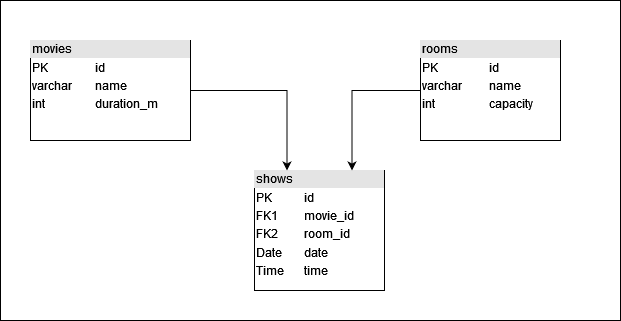

# Cinema Management Tool

By Kristijan Kusic, Patrick Leitner and Philipp Schermann

## Setup

1. open terminal and change directory into docker folder
2. run the command ```docker compose up -d```
3. run  ```mvn package``` (in IntelliJ, look under Maven/bweng/Lifecyle)
4. start the project via the run button

## Milestone 1 concept

3 Entities Room, Movie and Show.

The room has the attributes name, capacity and cleaning time.
The movie has the attributes name and duration.
The show has the attributes startTime (date+time), movie and room.

Every duration should be in minutes.

When the Show is created or updated, there should be a check for conflicting shows in the same room.

### Minimal Database Model


